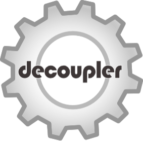

# decoupler - Ensemble of methods to infer enrichment scores



[![Tests][badge-tests]][tests]
[![Documentation][badge-docs]][documentation]

[![Issues][badge-issues]][issue tracker]
[![Coverage][badge-coverage]][codecoverage]
[![Stars][badge-stars]](https://github.com/scverse/anndata/stargazers)

[![PyPI][badge-pypi]][pypi]
[![Downloads month][badge-mdown]][down]
[![Downloads all][badge-adown]][down]

[![Conda version][badge-condav]][conda]
[![Conda downloads][badge-condad]][conda]

[badge-tests]: https://img.shields.io/github/actions/workflow/status/scverse/decoupler/test.yaml?branch=main
[badge-docs]: https://img.shields.io/readthedocs/decoupler
[badge-condav]: https://img.shields.io/conda/vn/conda-forge/decoupler-py.svg
[badge-condad]: https://img.shields.io/conda/dn/conda-forge/decoupler-py.svg
[badge-issues]: https://img.shields.io/github/issues/scverse/decoupler
[badge-coverage]: https://codecov.io/gh/scverse/decoupler/branch/main/graph/badge.svg
[badge-pypi]: https://img.shields.io/pypi/v/decoupler.svg
[badge-mdown]: https://static.pepy.tech/badge/decoupler/month
[badge-adown]: https://static.pepy.tech/badge/decoupler
[badge-stars]: https://img.shields.io/github/stars/scverse/decoupler?style=flat&logo=github&color=yellow

`decoupler` is a python package containing different enrichment statistical
methods to extract biologically driven scores
from omics data within a unified framework. This is its faster and memory efficient Python implementation,
a deprecated version in R can be found [here](https://github.com/saezlab/decoupler).

[//]: # (numfocus-fiscal-sponsor-attribution)

decoupler is part of the scverse® project ([website](https://scverse.org), [governance](https://scverse.org/about/roles)) and is fiscally sponsored by [NumFOCUS](https://numfocus.org/).
If you like scverse® and want to support our mission, please consider making a tax-deductible [donation](https://numfocus.org/donate-to-scverse) to help the project pay for developer time, professional services, travel, workshops, and a variety of other needs.

<div align="center">
<a href="https://numfocus.org/project/scverse">
  
</a>
</div>

## Getting started

Please refer to the [documentation][],
in particular, the [API documentation][].

## Installation

You need to have Python 3.10 or newer installed on your system.
If you don't have Python installed, we recommend installing [uv][].

There are several alternative options to install decoupler:

1. Install the latest stable release from [PyPI][pypi] with minimal dependancies:

```bash
pip install decoupler
```

2. Install the latest stable full release from [PyPI][pypi] with extra dependancies:

```bash
pip install decoupler[full]
```

3. Install the latest stable version from [conda-forge][conda] using mamba or conda (pay attention to the `-py` suffix at the end):

```bash
mamba create -n=dcp conda-forge::decoupler-py
```

4. Install the latest development version:

```bash
pip install git+https://github.com/scverse/decoupler.git@main
```

## Release notes

See the [changelog][].

## Contact

For questions and help requests, you can reach out in the [scverse discourse][].
If you found a bug, please use the [issue tracker][].

## Citation

> Badia-i-Mompel P., Vélez Santiago J., Braunger J., Geiss C., Dimitrov D.,
Müller-Dott S., Taus P., Dugourd A., Holland C.H., Ramirez Flores R.O.
and Saez-Rodriguez J. 2022. decoupleR: Ensemble of computational methods
to infer biological activities from omics data. Bioinformatics Advances.
<https://doi.org/10.1093/bioadv/vbac016>

[uv]: https://github.com/astral-sh/uv
[scverse discourse]: https://discourse.scverse.org/
[scverse]: https://scverse.org/
[issue tracker]: https://github.com/scverse/decoupler/issues
[tests]: https://github.com/scverse/decoupler/actions/workflows/test.yaml
[documentation]: https://decoupler.readthedocs.io
[changelog]: https://decoupler.readthedocs.io/en/latest/changelog.html
[api documentation]: https://decoupler.readthedocs.io/en/latest/api.html
[pypi]: https://pypi.org/project/decoupler
[down]: https://pepy.tech/project/decoupler
[conda]: https://anaconda.org/conda-forge/decoupler-py
[codecoverage]: https://codecov.io/gh/scverse/decoupler
